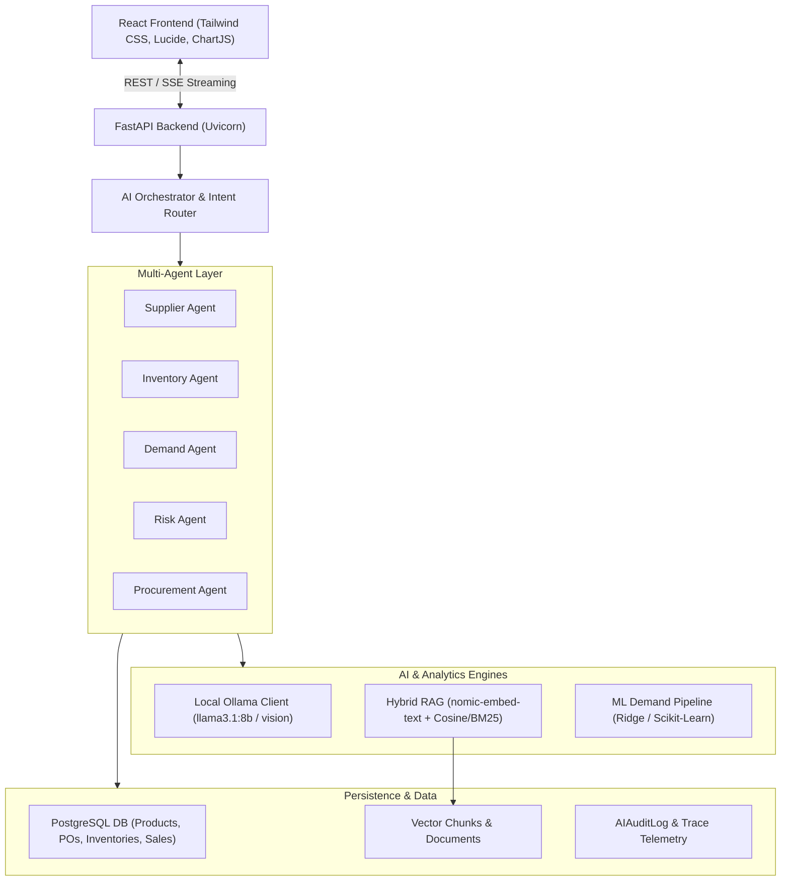

# 🚀 Local AI-Powered Supply Chain Intelligence & Commerce Platform

An enterprise-grade, real local-AI-powered supply chain intelligence and autonomous operations platform. Built with **Ollama**, **Local LLMs**, **pgvector & Hybrid RAG**, **Multi-Agent Systems**, **Machine Learning Demand Forecasting**, **Multimodal Document Processing**, **FastAPI**, and **React + Tailwind CSS**.

---

## 🌟 Key Capabilities

### 🧠 Real Local AI & Multi-Agent Architecture
- **100% Local Inference**: Runs via [Ollama](https://ollama.com/) on `http://localhost:11434` without sending internal enterprise data to external APIs.
- **Deterministic Business Grounding**: All calculations, metrics, inventory levels, lead times, safety stocks, and supplier scorecards are computed deterministically in Python/SQL before feeding context to Ollama for natural language rationale.
- **Ollama-Offline Resilient**: If Ollama is offline or models are still downloading, the entire platform gracefully falls back to deterministic rule-based analyses and heuristic summaries with status banners.
- **Strict Role-Based Tool Guardrails**:
  - Procurement Agent recommends reorders with human-in-the-loop approval.
  - LLMs cannot execute raw SQL or mutate database records without explicit user authorization and RBAC verification.
  - Complete prompt-injection detection and sanitization.

| Agent | Responsibility | Core Logic & Grounding |
|---|---|---|
| **Supplier Agent** | Vendor scoring, trade-off analysis, dual-sourcing | Weighted multi-factor deterministic model: Price (40%), Quality (30%), Delivery (20%), Reliability (10%) + Ollama rationale. |
| **Inventory Agent** | Stockout mitigation, safety buffer, reorder points | Dynamic Reorder Point $ROP = (d \times L) + SS$, coverage days, stock velocity analysis. |
| **Demand Agent** | ML sales velocity forecasting & anomaly detection | Chronological Ridge regression with 70/15/15 train/val/test split, moving averages, day-of-week & trend features, MAE/RMSE/MAPE metrics. |
| **Risk Agent** | Single-source supplier risk & disruption analysis | Cross-correlates inventory run-rate, vendor lead-time variance, and geographic single points of failure. |
| **Procurement Agent** | PO generation & human approval workflow | Recommends replenishment with financial impact and requires Admin/Manager authorization before creating real Purchase Orders. |

---

### 📚 Enterprise Hybrid RAG (Retrieval-Augmented Generation)
- **Multi-Format Ingestion**: Ingests PDF contracts, Word documents (`.docx`), plain text (`.txt`), and supplier invoices.
- **Smart Chunking**: Semantic & recursive paragraph-based chunking with configurable overlap (500 chars / 50 overlap).
- **Hybrid Search**: Combines dense vector cosine similarity (via `nomic-embed-text` with deterministic local hash fallback) and full-text keyword BM25/trigram matching.
- **Cross-Encoder Reranking**: Re-ranks top-$k$ retrieved chunks by relevance score.
- **Verifiable Citations**: Every RAG-augmented response includes exact document filenames, chunk IDs, page numbers, and preview snippets.

---

### 👁️ Multimodal Document & Vision Processing
- **Supplier Invoice Extraction**: Uses local `llama3.2-vision` to parse PO numbers, supplier names, line items, and totals directly from invoice images and PDFs.
- **Packaging & Defect Inspection**: Inspects product images for transit damage, label compliance, barcode clarity, and seal integrity.

---

### 📊 Modern React Admin Suite
- **AI Intelligence Hub** (`/admin/ai`): Live interactive multi-agent chat, agent status monitor, dynamic streaming responses, and execution trace inspection.
- **Knowledge Base RAG** (`/admin/knowledge`): Drag-and-drop document upload, processing status, chunk inspector, and document question-answering with citation chips.
- **Predictive Demand Forecasting** (`/admin/forecasting`): Interactive 7-day to 90-day forecast charts, model evaluation telemetry (MAE, RMSE, MAPE), and re-training trigger.
- **Risk Assessment Dashboard** (`/admin/risk`): Supply chain risk heatmaps, single-source dependency flags, and automated mitigation plans.
- **Autonomous Recommendations** (`/admin/recommendations`): Human-in-the-loop reorder recommendations with 1-click PO creation and audit trail.
- **AI Engine Settings** (`/admin/ai/settings`): Ollama connection health, model selection dropdowns, temperature controls, and system diagnostic logs.

---

## 🛠️ Architecture & Tech Stack



- **Backend**: Python 3.11+, FastAPI, SQLAlchemy, Alembic, Pydantic v2, Scikit-learn, PyPDF, python-docx, Pillow, httpx.
- **Local AI Runtime**: Ollama (`http://localhost:11434`), `llama3.1:8b`, `nomic-embed-text`, `llama3.2-vision`.
- **Database**: PostgreSQL with schema migrations via Alembic.
- **Frontend**: React 19, Vite, Tailwind CSS v4, Lucide React, Axios.

---

## ⚡ Quick Start Guide

### 1. Set Up Local Ollama & Models

Ensure Ollama is installed ([Download Ollama](https://ollama.com/)):

```bash
# Start Ollama service (runs on port 11434)
ollama serve

# Pull recommended models
ollama pull llama3.1:8b
ollama pull nomic-embed-text
ollama pull llama3.2-vision
```

*Note: If any model is missing, the backend continues to function automatically in resilient fallback mode.*

---

### 2. Configure & Run Backend

```bash
cd backend

# Create and activate virtual environment
python -m venv .venv
# On Windows:
.venv\Scripts\activate
# On Linux/macOS:
# source .venv/bin/activate

# Install dependencies
pip install -r requirements.txt

# Run database migrations
python -m alembic upgrade head

# Start FastAPI server
python -m uvicorn main:app --reload --host 127.0.0.1 --port 8000
```
- Interactive API Docs (Swagger): `http://127.0.0.1:8000/docs`
- Health Check: `http://127.0.0.1:8000/api/health`
- Ollama Health Status: `http://127.0.0.1:8000/api/ai/health`

---

### 3. Start Frontend Admin Suite

```bash
cd frontend

# Install dependencies
npm install

# Start Vite dev server
npm run dev
```
- Web Application: `http://localhost:5173`
- Default Admin Credentials:
  - **Email**: `admin@emox.ai`
  - **Password**: `admin123`

---

## 🧪 Verification & Automated Testing

### AI Platform Test Suite
Verifies Ollama connectivity, deterministic agent calculations, ML forecasting pipeline, RAG chunking and retrieval, human approval PO workflow, and security tool guardrails:

```bash
cd backend
python -m pytest ../tests/test_ai_platform.py -v
```

### End-to-End Commerce & Operations Suite
Verifies full catalog, checkout, order decrement, supplier optimization, PO progression, and audit logs:

```bash
python tests/test_e2e_platform.py
```

---

## 🛡️ Security & Guardrails

- **Zero Autonomous Financial Execution**: The Procurement Agent creates recommendations with status `pending_approval`. Only users with `admin` or `manager` roles can authorize real Purchase Orders.
- **SQL Injection & Tool Sandboxing**: Agents interact exclusively via typed Python tools with Pydantic validation. No dynamic SQL execution is permitted.
- **Prompt Injection Defense**: All user inputs are sanitized and screened for jailbreak patterns before prompt assembly.
- **Full Traceability**: All tool executions and agent decisions are logged to `ai_audit_logs` with timestamps, executing user, parameters, and results.