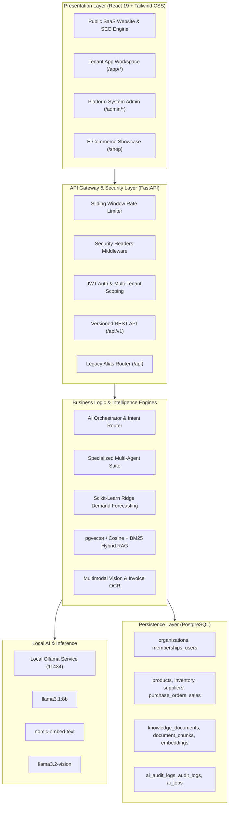

# EMOX AI Supply Chain — Platform Architecture

## 1. System Overview

EMOX AI-Supplychain is an enterprise-grade Autonomous Supply Chain Intelligence and SaaS operations platform designed to eliminate stockouts, optimize purchase order replenishment, model future demand velocity with Scikit-learn machine learning, and score suppliers across multi-factor criteria.

---

## 2. Multi-Tier Architecture

### 2.1 Presentation Tier
- **Framework**: React 19, Vite, Tailwind CSS v4, Lucide React, Context API.
- **Route Segregation**:
  - `Public Marketing`: Indexable B2B SaaS marketing site with dynamic JSON-LD structured schemas, OpenGraph metadata, and XML sitemaps.
  - `Tenant Application Workspace (/app/*)`: Multi-tenant workspace with organization switcher, role badges, and operational dashboards.
  - `Platform Admin Console (/admin/*)`: Global user management, tenant organization provisioning, background AI jobs, and telemetry logs.
  - `Customer Storefront (/shop)`: Preserved e-commerce checkout and product catalog.

### 2.2 API & Middleware Tier
- **Framework**: FastAPI (Python 3.11+ / 3.14+).
- **Security Headers**: Automatic injection of `X-Content-Type-Options`, `X-Frame-Options`, `X-XSS-Protection`, and `Referrer-Policy`.
- **Rate Limiting**: Sliding window in-memory limiter protecting `/auth/login`, `/ai/chat`, and file upload endpoints.
- **API Versioning**: Standardized `/api/v1` routes with `/api` alias for 100% backward compatibility.

### 2.3 AI & Multi-Agent Tier
- **Deterministic Calculation First**: Numerical metrics (Reorder Points, Safety Stock, Forecast Velocities, Multi-factor Vendor Scores) are computed in Python/SQL before feeding context to language models.
- **Local Ollama Inference**: Runs via `http://localhost:11434` with zero proprietary data transmission to cloud providers.
- **Resilient Fallback**: Graceful heuristic degradation with UI status indicators if Ollama is offline or models are downloading.

### 2.4 Data Tier
- **Database**: PostgreSQL with Alembic migration versioning.
- **Multi-Tenancy**: All operational records contain an indexed `organization_id` foreign key.
- **Audit Logging**: Immutable tracking of every agent decision, tool execution, and user mutation.
