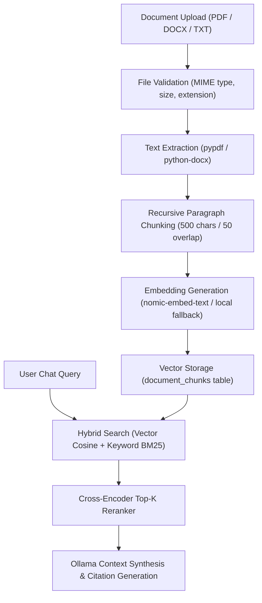

# Enterprise Hybrid RAG Architecture

## 1. Pipeline Overview

The EMOX Knowledge Base enables supply chain teams to ingest supplier contracts, logistics policies, compliance certificates, and operating manuals, converting them into searchable context for the AI Assistant.

---

## 2. Ingestion & Semantic Chunking

1. **File Validation**:
   - Allowed MIME types: `application/pdf`, `application/vnd.openxmlformats-officedocument.wordprocessingml.document`, `text/plain`.
   - Maximum upload size: 20 MB.
   - Files stored safely outside executable directories in `uploaded_documents/`.
2. **Chunking Strategy**:
   - Paragraph-aware recursive chunking with 500 characters and 50 character overlap.
   - Metadata attached per chunk: `document_id`, `organization_id`, `chunk_index`, `page_number`, `source_filename`.

---

## 3. Hybrid Search & Grounded Citations

- **Dense Retrieval**: Cosine similarity against 768-dimensional float vectors generated by `nomic-embed-text` (or deterministic localized hash embeddings if Ollama embedding model is offline).
- **Sparse Retrieval**: Trigram and BM25 keyword matching across chunk text.
- **Score Fusion**:
  $$\text{Score} = 0.70 \times \text{Cosine}(\vec{q}, \vec{d}) + 0.30 \times \text{BM25}(q, d)$$
- **Exact Verifiable Citations**: Every RAG-augmented response returns citation chips containing document name, chunk ID, page number, and snippet text.
